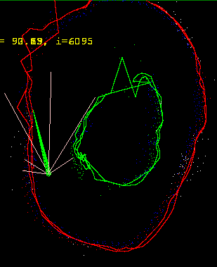

# README #

This readme explains what is necessary to get the code up and running.
A markdown tutorial can be seen here: (https://bitbucket.org/tutorials/markdowndemo)

### Prerequisites ###
You should have a robot that has a device that sends log messages as JSON
and can accept messages as inputs.
For instance use the Norbot esp8266mqttlogger

### What is this repository for? ###

* Storing log files to sqllite3 database - use mqttLogger/mqttLogger.py
* Play back stored log files for use in analysis etc. mqttLogger/mqttLogPlayback.py
* Location and mapping of the robots in a space and plotting of sensor - Use mapCreator/carPlotter.py
* Tune and set variable values inside the robot - Use variableTuner/variableTuner.py
* Send simple commands to the robot - Use commandSender/commandSender.py
* Display all variable values that are sent as JSON - Use variableDisplay/variableDisplay.py
* List everything that come as MQTT messages on the channel - Use utilities/mqttSubscriber.py
* Plotting log files for analysis (not ready yet)
* exporting log files to excel (not ready yet)

### How do I get set up? ###

* Download the source files.
* Make your logs from your robot come as JSON in  MQTT messages. (for instance make your robot send MQTT messages as JSON)
* Install python (Select for instance Anaconda 4 from https://www.continuum.io/)
* [pythondir]/scripts/pip install paho-mqtt
* [pythondir]/scripts/pip install pygame
* Create your car configuration.  robotConfig.py
* Install Erlang and RabbitMQ.
* Install MQTT Adapter for RabbitMQ. Install management pluging for RabbitMQ
* Crate user norbot with password Pass4norbot in RabbitMQ.

### Contribution guidelines ###

* Writing tests
* Code review
* Other guidelines

### Who do I talk to? ###

* Repo owner or admin
* Other community or team contact

### Setting up a hosted network (Win 10) ###
NETSH WLAN set hostednetwork mode=allow ssid=norbot_pc key=Pass4norbot
NETSH WLAN show hostednetwork setting=security

NETSH WLAN start hostednetwork

--- SEE connected clients
@echo off
netsh wlan show hostednetwork | findstr -i status
echo SSID Name
netsh wlan show hostednetwork | findstr -i " ssid "
netsh wlan show hostednetwork setting=security
echo Connected clients
arp -a | findstr -i 192.168.137 | findstr /V 255 | findstr /V 192.168.137.1

